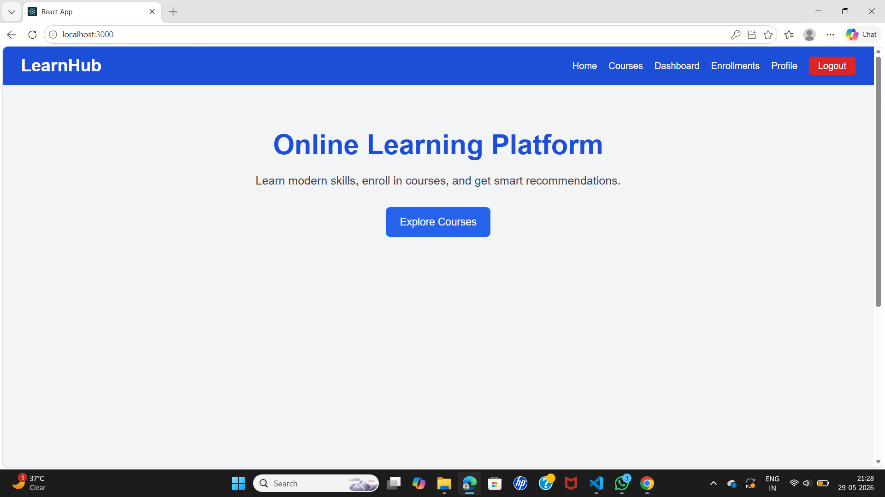
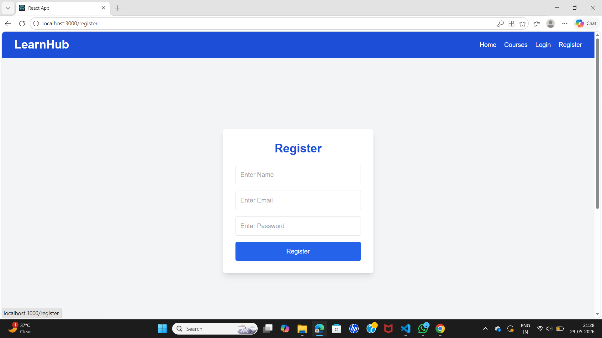
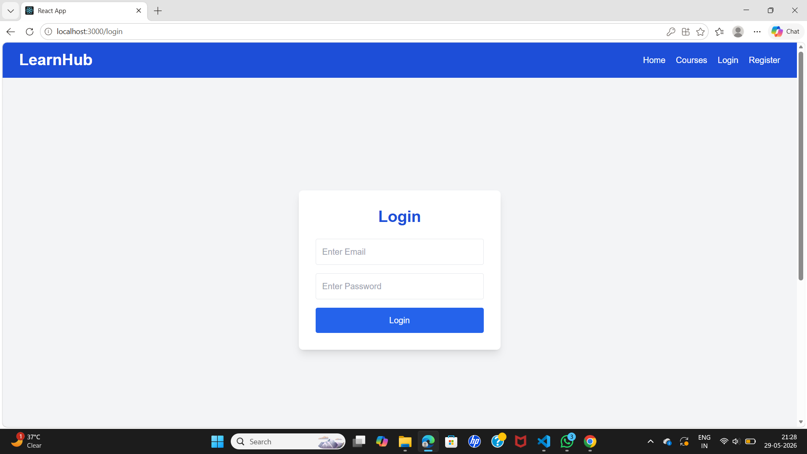
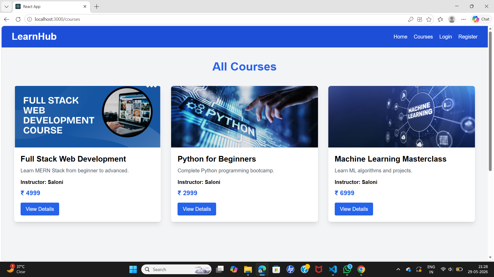
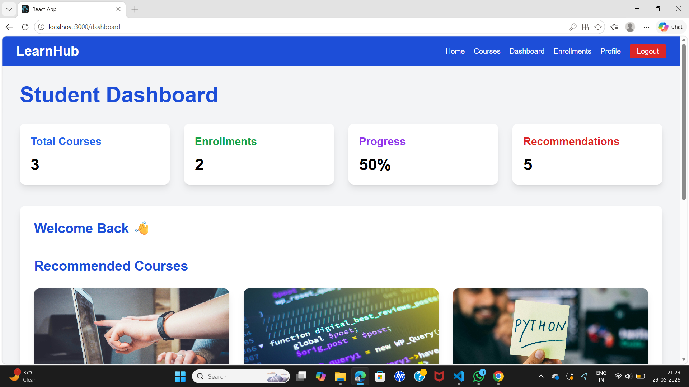
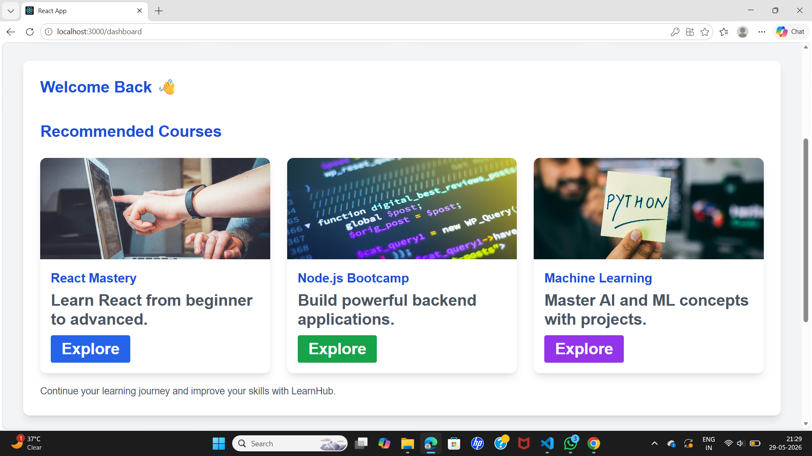
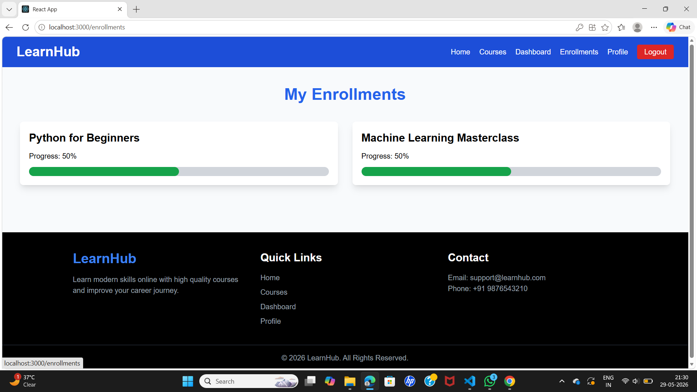
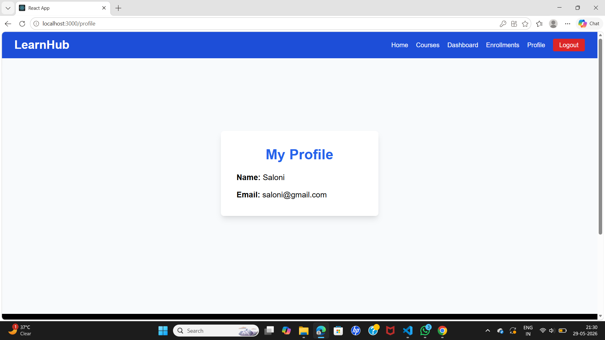

## Online Learning Course Recommendation Platform

## 📌 Project Overview

The Online Learning Course Recommendation Platform is a full-stack MERN application developed to simulate a real-world EdTech learning system. The platform allows users to register, log in, explore courses, enroll in courses, track learning progress, and receive personalized course recommendations based on interests and skills.

This project demonstrates authentication, REST APIs, recommendation systems, progress tracking, dashboard analytics, and responsive UI design using modern web technologies.

---

## ❓ Problem Statement

Traditional online learning systems often fail to provide personalized course recommendations and effective learner progress tracking. Students struggle to discover relevant courses according to their interests and skills.

This project solves the problem by:

- recommending suitable courses
- tracking learner progress
- managing enrollments
- providing a personalized dashboard experience

---

## ✨ Features

# User Authentication

- User Registration
- User Login
- JWT Authentication
- Protected Routes
- Logout Functionality

---

# Course Module

- View All Courses
- Course Details Page
- Course Images
- Course Pricing
- Instructor Details

---

# Recommendation System

- Recommend courses based on learner interests
- Recommend courses based on skills
- Recommend courses based on category matching
- Exclude already enrolled courses

---

# Enrollment System

- Enroll in Courses
- View Enrolled Courses
- Enrollment Tracking

---

# Progress Tracking

- Update Course Progress
- Dynamic Progress Percentage
- Progress Bar UI

---

# Dashboard

- Dashboard Analytics
- Recommended Courses
- Learning Statistics
- Responsive Dashboard UI

---

## 🧠 Recommendation Logic

The recommendation system works by:

1. Analyzing learner interests
2. Matching course categories
3. Matching skill tags
4. Filtering enrolled courses
5. Displaying relevant recommended courses

Example:

- Learner interested in AI → shows Machine Learning courses
- Learner interested in Web Development → shows MERN/React courses

---

## 🛠️ Tech Stack

# Frontend

- React.js
- React Router DOM
- Axios
- Tailwind CSS

---

# Backend

- Node.js
- Express.js
- MongoDB
- Mongoose
- JWT Authentication

---

# Database

- MongoDB Atlas

---

## 🏗️ Project Architecture

Frontend (React)
       ↓
REST API Calls (Axios)
       ↓
Backend Server (Express.js)
       ↓
MongoDB Database

---

```

## 📂 Folder Structure

ONLINE-LEARNING-PLATFORM/
│
├── backend/
│   ├── config/
│   ├── controllers/
│   ├── middleware/
│   ├── models/
│   ├── routes/
│   ├── data/
│   ├── server.js
│   └── package.json
│
├── frontend/
│   ├── public/
│   ├── src/
│   │   ├── components/
│   │   ├── pages/
│   │   ├── services/
│   │   ├── App.js
│   │   └── index.js
│   └── package.json
│
├── screenshots/
├── README.md
└── .gitignore


```

---

## 🔗 API Endpoints

# Authentication Routes

Register User

POST /api/auth/register

Login User

POST /api/auth/login

---

# Course Routes

Get All Courses

GET /api/courses

Get Single Course

GET /api/courses/:id

---

# Enrollment Routes

Enroll in Course

POST /api/enrollments

Get User Enrollments

GET /api/enrollments/my-enrollments

---

# Progress Routes

Update Progress

POST /api/progress/update

Get Progress

GET /api/progress/my-progress

---

## ▶️ How to Run the Project

# Step 1 — Clone Repository

git clone <https://github.com/keshkarsaloni-lab/Online-Learning-Platform.git>

---

# Step 2 — Backend Setup

cd backend
npm install
npm start

Expected Output:

MongoDB Connected
Server running on port 5000

---

# Step 3 — Frontend Setup

cd frontend
npm install
npm start

Frontend URL:

http://localhost:3000

Backend URL:

http://localhost:5000

---

# Step 4 — Environment Variables

Create ".env" file inside backend folder.

MONGO_URI=your_mongodb_connection
JWT_SECRET=your_secret_key
PORT=5000

---

## 📸 Project Screenshots

### Home Page


### Register Page


### Login Page


### Courses Page


### Dashboard Overview


### Dashboard Recommendations


### Enrollments Page


### Profile Page


---

## 🎥 Project Demo Video

[Watch Demo Video](screenshots/Online_Learning_Platform_Demo.mp4)

---

## 📚 Learning Outcomes

Through this project, the following concepts were learned:

- Full Stack MERN Development
- REST API Development
- JWT Authentication
- MongoDB Database Design
- React Routing
- State Management
- Recommendation Logic
- API Integration
- Progress Tracking Systems
- Responsive UI Design
- GitHub Project Structuring

---

## 🚀 Future Improvements

- Payment Gateway Integration
- Real-Time Notifications
- Video Course Streaming
- AI-Based Recommendations
- Admin Dashboard
- Quiz & Certification System

---

## 👨‍💻 Developed By

Saloni Keshkar

---